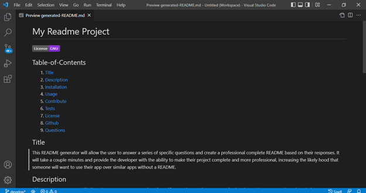
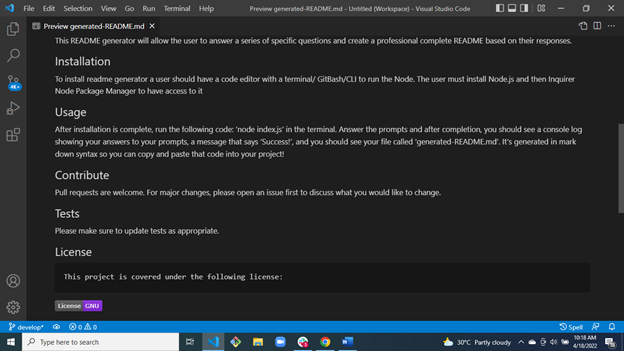
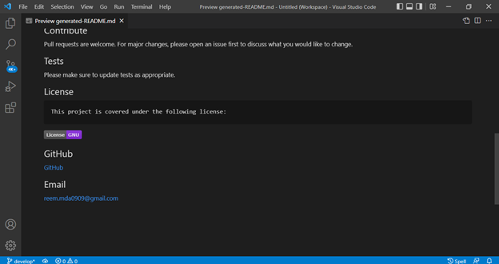

# README Generator by Reem Ahmed

## What is a README?

A great README file helps your project to stand out from the sea of open-source software on GitHub. A README is like the face of your project. It is the first file a person should read when encountering a source tree, and it should be written as a very brief and giving very basic introduction to the software

## What is a README generator?

An automated README.md generator that uses the Inquirer NPM, File System (FS), and Node.js to automatically create README markdown files.
This README generator will allow the user to answer a series of specific questions and create a professional complete README based on their responses.

## How to Install Readme generator?

To install readme generator a user should have a code editor with a terminal/ GitBash/CLI to run the Node. The user must install Node.js and then Inquirer Node Package Manager to have access to it.

## How to Use it?

After installation is complete, run the following code: ‘node index.js’ in the terminal. Answer the prompts and after completion, you should see a console log showing your answers to your prompts, a message that says ‘Success!’, and you should see your file called ‘generated-README.md’. It’s generated in mark down syntax so you can copy and paste that code into your project!
  
  For more information on how to add screenshots for examples, visit the following website:
  
  [Mark Down Tutorial]()

## Contributions 

Please include the names and details if you wish to contribute to this project

## Tests

To test this application please go to the root directory of your project in vs code and then run "node index.js". You will have to answer all the required questions in order to generate a readme file.

## Screenshots of generated-README.md

## User Story
AS A developer
I WANT a README generator
SO THAT I can quickly create a professional README for a new project

## License

## GitHub
Reem Ahmed (https://github.com/ReemMDA99/README-generator-by-Reem)

Deployed URL: https://reemmda99.github.io/README-generator-by-Reem/